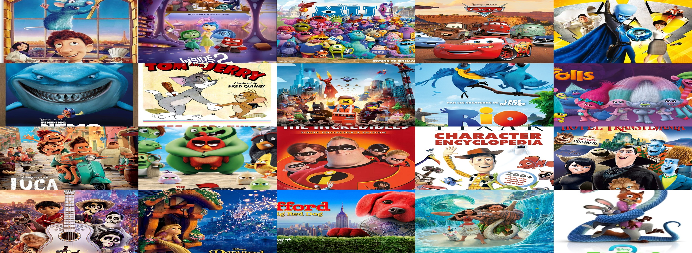

# 🧸 Kidflix - React Movie Discovery App

Welcome to **Kidflix**, a fun and colorful React.js project where users can discover and explore Studio Ghibli films through an interactive and modern UI.

 <!-- replace with your screenshot path if needed -->

## 🔗 Live Demo

👉 [Click here to view the live demo](https://aymaq-code.github.io/kidflix)
---

## ✨ Features

- 🔍 **Real-time Search** – Filter movies by title as you type
- 🎞️ **Flip Cards** – Hover to see more details about each movie
- 📺 **Popup Modal** – View extended movie information in a popup
- 📱 **Responsive Design** – Works great on all screen sizes
- 🍿 **Built using the Studio Ghibli API**
- 📩 **Email subscription input** for future expansion

---

## 🚀 Technologies Used

- **React.js (Hooks: useState, useEffect)**
- **HTML5 / CSS3** (Responsive Design with Flexbox & Grid)
- **Custom CSS Variables**
- **Studio Ghibli API** – [https://ghibliapi.vercel.app](https://ghibliapi.vercel.app)
- **Font Awesome** (social icons)

---

## 📦 Getting Started

Clone the project and run it locally:

```bash
git clone https://github.com/Aymaq-code/kidflix.git
cd kidflix
npm install
npm start
```
